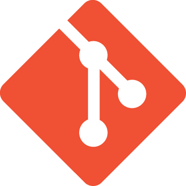

# Git学習まとめ

## 概要
このドキュメントは **Git** の基本を学んだ内容をまとめたものです。

バージョン管理の考え方から、実際のコマンドまでを整理しています。

***

## Gitとは
>Gitは分散型バージョン管理システムです。  
>ソースコードの変更履歴を記録し、チーム開発を効率化します。

詳しくは[Git公式サイト](https://git-scm.com/)を参照してください。

***

## 基本コマンド
### よく使うコマンド一覧
| コマンド | 説明 |
| ---- | ---- |
|`git init`|リポジトリを初期化|
|`git clone`|リモートからクローン|
|`git add`|変更をステージング|
|`git commit`|コミットを作成|
|`git push`|リモートに反映|
|`git pull`|リモートから取得・マージ|

### コミットの例
```bash
git add .
git commit -m "機能Aを追加"
git push origin main
```
## ブランチ戦略
開発では以下のブランチを使い分けます。
- **main**：本番環境用
- **dev**：開発用
- **feature/xxx**：機能開発用

### ブランチ作成の流れ
1. `dev`から新しいブランチを作成
2. 機能を実装
3. PRを作成してレビュー
4. `dev`にマージ

***

## 学習チェックリスト
- [x] ~~リポジトリの作成ができる~~
- [x] ~~コミットができる~~
- [x] ~~ブランチの作成・切り替えができる~~
- [ ] コンフリクトの解消ができる
- [ ] リベースを理解している

## 参考画像


***
## メモ
インラインコードは`git status`のように書きます。  
*斜体* や **太字** も活用しましょう。
